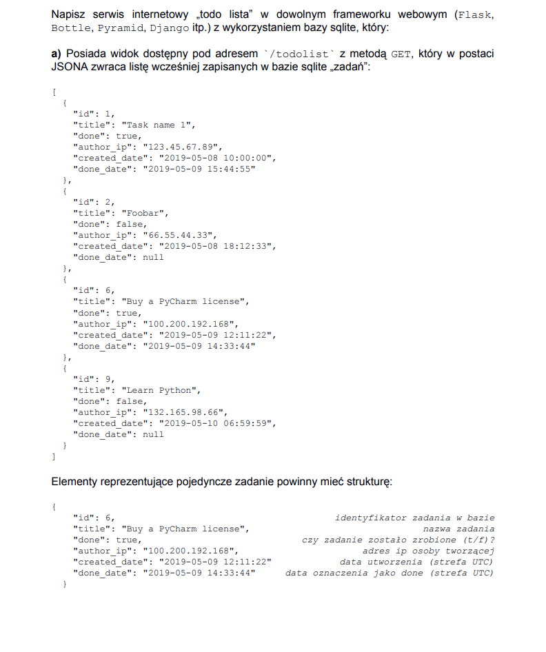
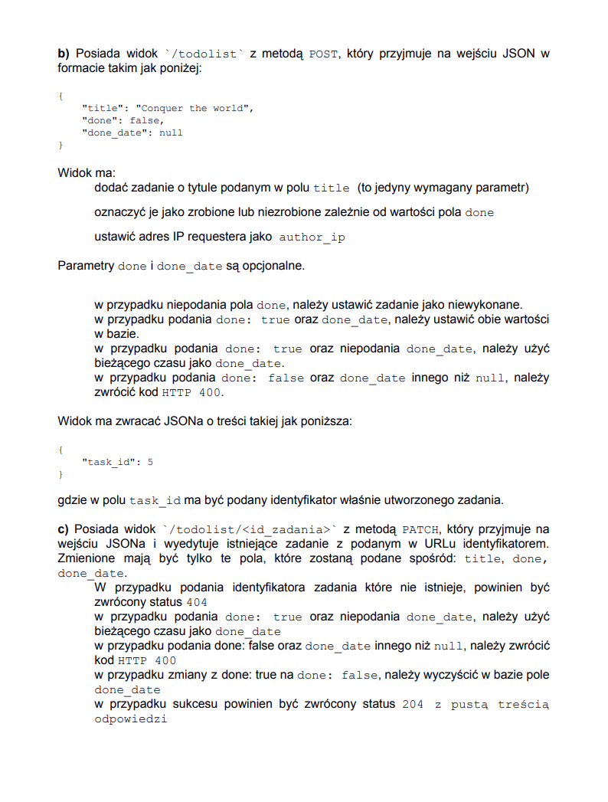
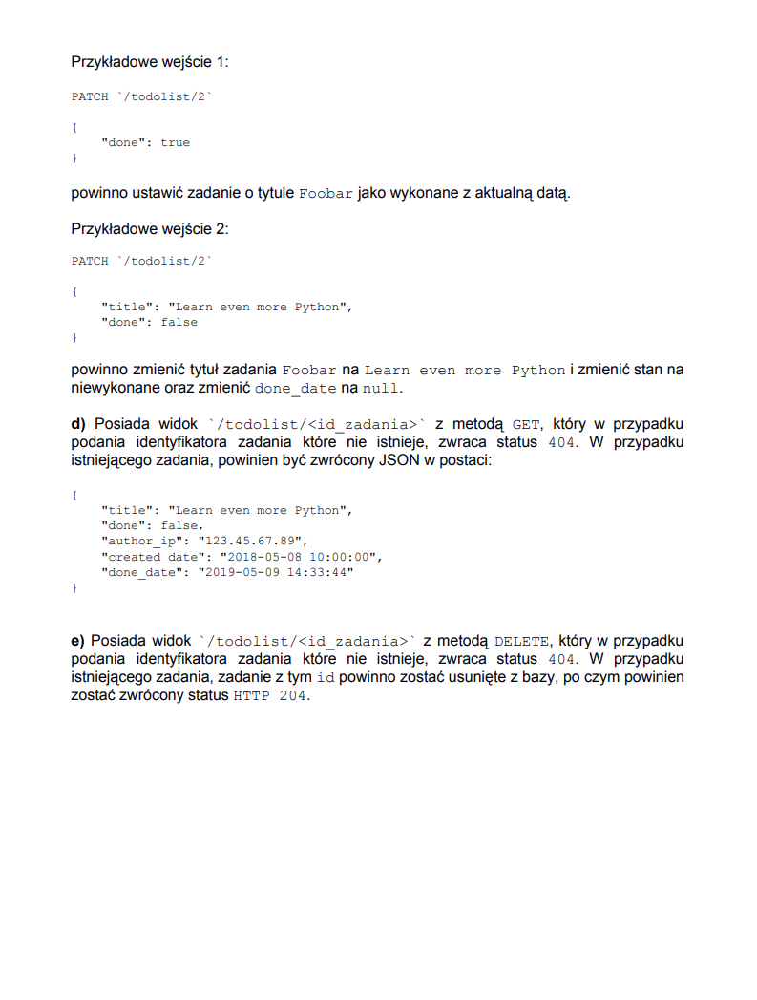

# ToDoList
To-do list made in Flask connected to SQLite database

## Table of contents
* [General info](#general-info)
* [Technologies](#technologies)
* [Features](#features)

## General info
Program made as a recruitment task

Task description (unfortunately only in polish):

## Technologies
* Python
* Flask
* SQLite

## Features
- has a view available at `/todolist` with the GET method, which returns a JSON list of previously saved" tasks "in the sqlite database.
Elements representing a single task have the following structure:
{
"id": 6, ID of the job in the database
"title": "Buy a PyCharm license", the name of the task
"done": true, was the task done (y / f)?
"author_ip": "100.200.192.168", author's ip address
"created_date": "2019-05-09 12:11:22" creation date (UTC zone)
"done_date": "2019-05-09 14:33:44" date marked as done (UTC zone)
}

- has a `/todolist` view with POST method, which accepts JSON as input:
{
"title": "Conquer the world",
"done": false,
"done_date": null
}
View:
  - adds a task with the title specified in the title field (this is the only required parameter)
  - marks them as done or not done depending on the value of the field done
  - set the requester IP address as author_ip
    Done and done_date are optional.
  - in case the field is not given, it sets the task as not completed
  - when done: true and done_date are given, it sets both values in the database
  - if done: true is given and done_date is not given, it uses the current time as done_date.
  - if done: false and done_date other than null are given, it returns HTTP 400 code.
The view returns JSON with the following content:
{
"task_id": 5
}
where the task_id field contains the identifier of the task just created.

- has a `/todolist/<task_id>` view with the PATCH method, which accepts JSON as input and edits an existing task with the id provided in the URL.
It only changes the fields that will be given from: title, done, done_date.
  - If an id of a task that does not exist is given, it returns 404 status.
  - If done: true is specified and done_date is not specified, it uses the current time as done_date.
  - If done: false and done_date other than null are given, it returns HTTP 400 code.
  - When changing from done: true to done: false, clears the done_date field in the database.
  - On success, returns a status of 204 with an empty response.
  

- has a view `/todolist/<task_id>` with the GET method, which returns 404 if the id of a task that does not exist, returns 404 for an existing task.
{
"title": "Learn even more Python",
"done": false,
"author_ip": "123.45.67.89",
"created_date": "2018-05-08 10:00:00",
"done_date": "2019-05-09 14:33:44"
}

- has a view `/todolist/<task_id>` with the DELETE method, which, if the id of a task that does not exist, is given, returns the 404 status. In the case of an existing task, the task with this id is removed from the database, and then the HTTP 204 status is returned .
